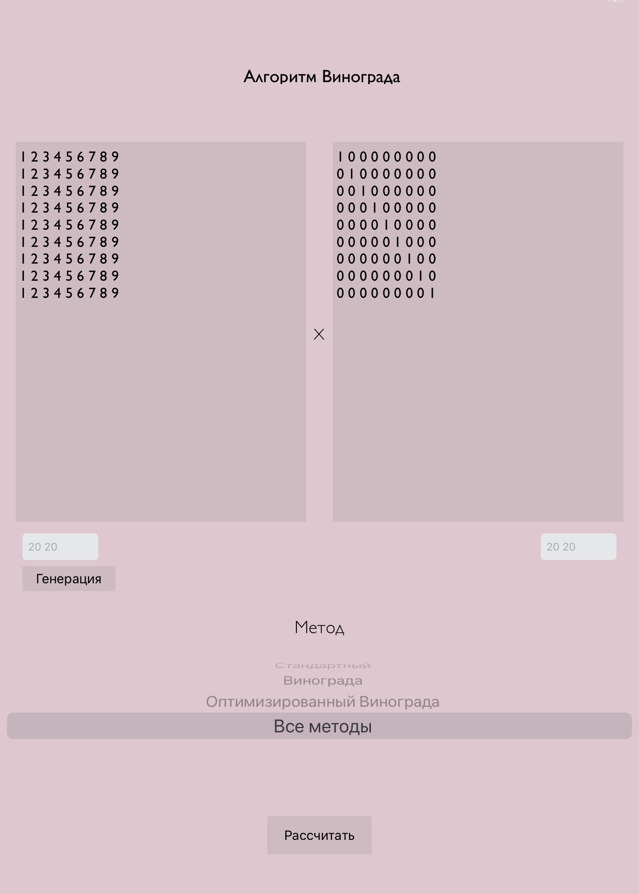
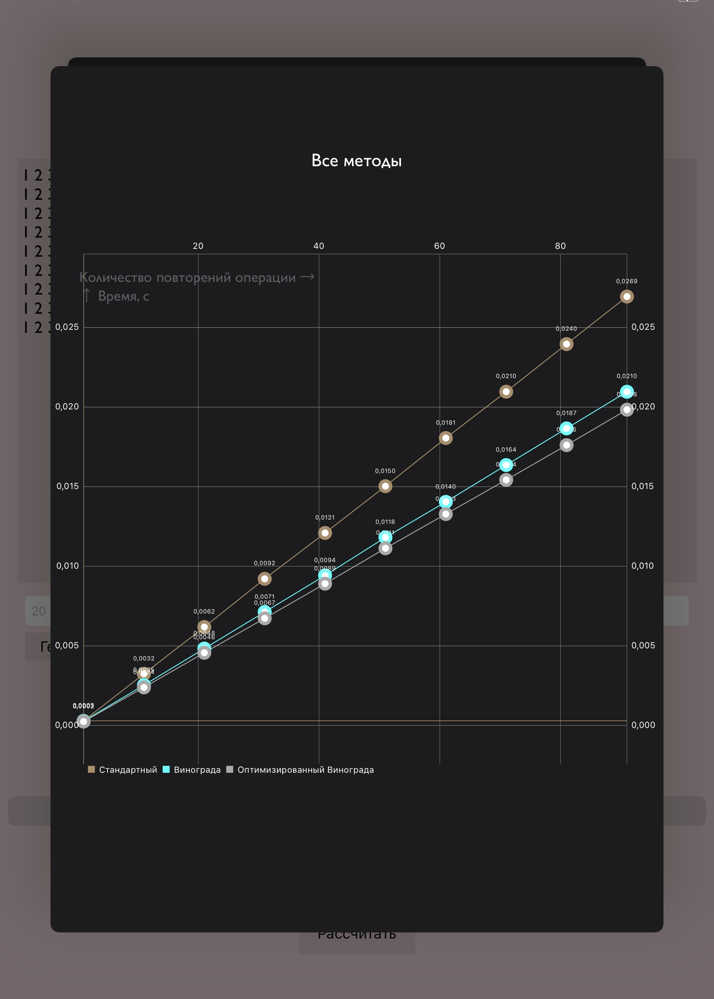

## Умножение матриц

***Стэк:*** 
* Storyboard  
* CocoaPods | Charts (графики)  

***Тема:*** Умножение матриц  
***Цель работы:*** Изучение и реализация алгоритмов умножения матриц и вычисление их трудоёмкости.  

***Модификации для Винограда по варианту:***  
* замена _x = x + k_ на _x += k_;  
* замена деления на 2 побитовым сдвигом;  
* предвычислять некоторые слагаемые.
  
***Задачи:***
1. Изучить классический алгоритм умножения матриц, алгоритм Винограда и модифицированный алгоритм Винограда.  
2. Реализовать классический алгоритм умножения матриц, алгоритм Винограда и модифицированный алгоритм Винограда.  
3. Дать оценку трудоёмкости алгоритмов.  
4. Замерить время работы алгоритмов.  
5. Провести сравнительный анализ на основе полученных эксперимен- тально данных.   
  
`Реализация алгоритмов: Winograd/Winograd/algorithms.swift`

***Интерфейс***

